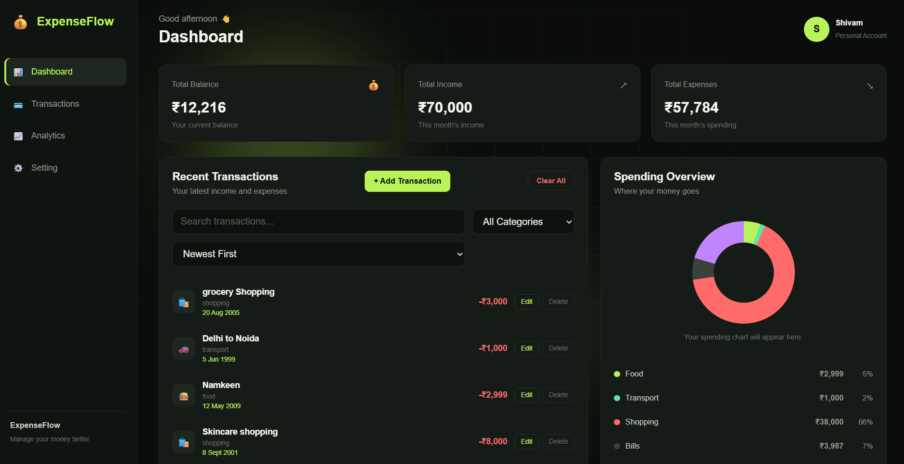
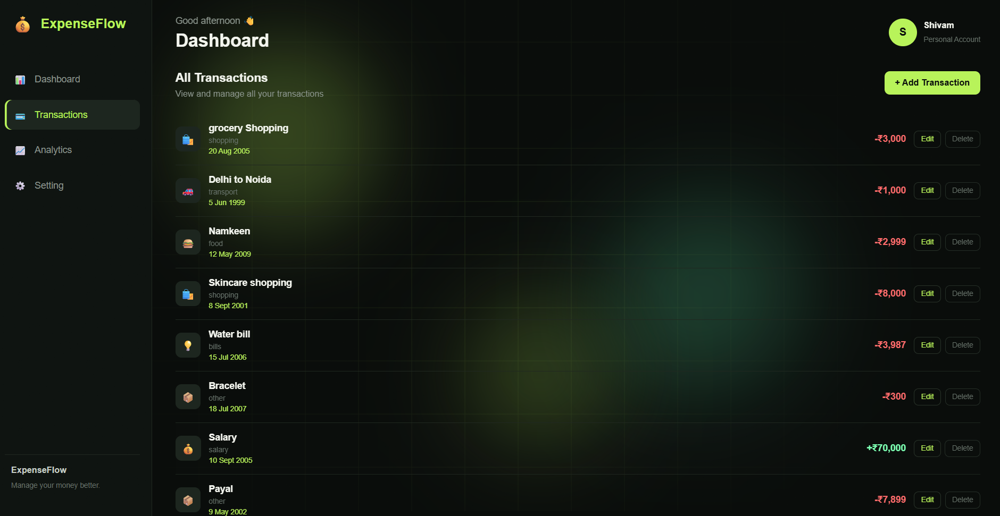
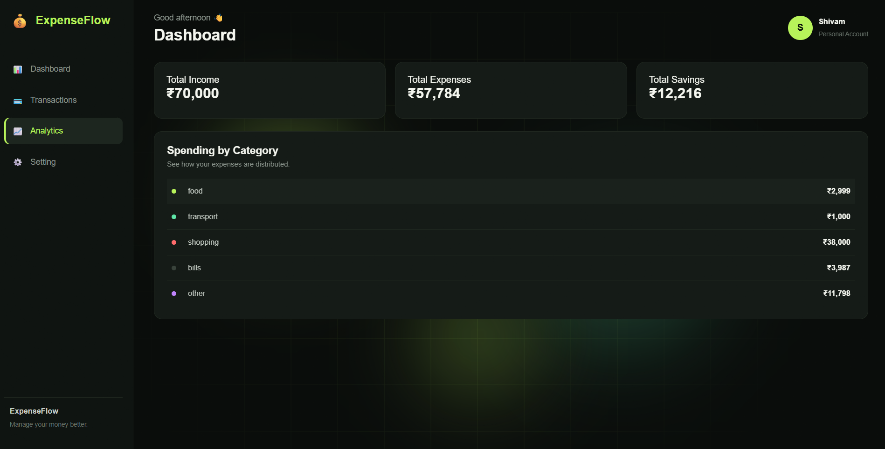
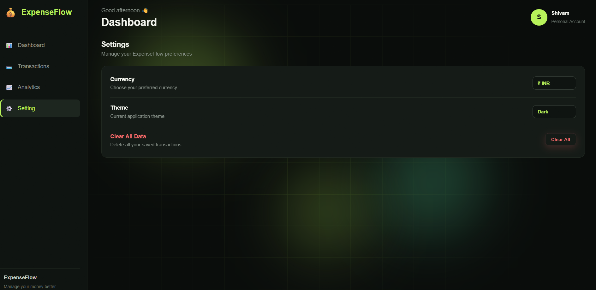
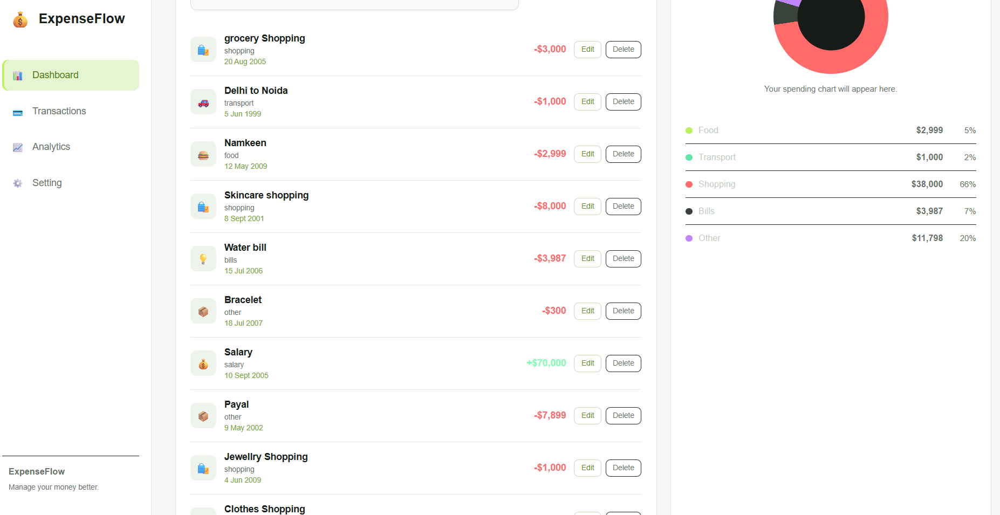
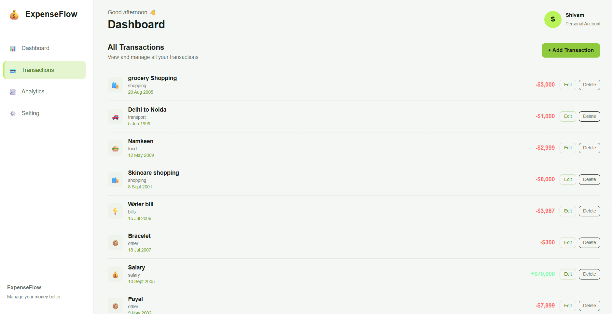

<div align="center">

# 💰 ExpenseFlow

**A clean, modern expense tracker that runs entirely in your browser.**
Track income and spending, see where your money goes, and stay in control, with no sign-up and no backend.

[](#-tech-stack)
[](#-tech-stack)
[](#-tech-stack)
[](#-license)

[**🌐 Live Demo**](https://heyGunjan.github.io/expenseflow-tracker/) · [**🐛 Report a Bug**](https://github.com/heyGunjan/expenseflow-tracker/issues) · [**💡 Request a Feature**](https://github.com/heyGunjan/expenseflow-tracker/issues)

<!-- Replace with your own screenshot: put it in /screenshots and update the path -->


</div>

---

## 📖 About

**ExpenseFlow** is a personal finance dashboard built with plain **HTML, CSS and JavaScript**, with no frameworks and no libraries. Add your income and expenses, browse them, and get an instant visual breakdown of your spending by category.

All your data is stored in your browser's **`localStorage`**, so it stays private on your device and is still there when you come back.

## ✨ Features

- 📊 **Dashboard**: total balance, income and expenses at a glance, with animated counters
- ➕ **Add, edit and delete** transactions with a smooth modal form
- 🔍 **Search** transactions by description
- 🏷️ **Filter** by category: Food, Transport, Shopping, Bills, Salary, Other
- ↕️ **Sort** by newest, oldest, highest or lowest amount
- 🍩 **Spending chart**: a pure-CSS donut chart with a hover tooltip showing category, amount and percentage
- 📈 **Analytics page**: total income, expenses, savings, and spending by category
- 🌗 **Dark and light theme**, remembered between visits
- 💱 **Currency switch** between ₹ INR and $ USD
- 🗑️ **Confirmation dialogs** before deleting one transaction or clearing everything
- 🎨 **Polished UI**: loading screen, animated ambient background, toast notifications, staggered list animations
- 💾 **Persistent data** using the browser's `localStorage`

## 🛠️ Tech Stack

| Layer | Technology |
| --- | --- |
| Structure | HTML5 |
| Styling | CSS3 (Grid, Flexbox, animations, `conic-gradient`) |
| Logic | Vanilla JavaScript (ES6+) |
| Storage | Browser `localStorage` |

## 🚀 Getting Started

No installation or build step is needed.

```bash
# 1. Clone the repository
git clone https://github.com/heyGunjan/expenseflow-tracker.git

# 2. Go into the project folder
cd expenseflow-tracker

# 3. Open index.html in your browser
```

Or just double-click `index.html`. To use a local server instead, VS Code's **Live Server** extension works well.

## 📂 Project Structure

```
expenseflow-tracker/
├── index.html      # App layout: sidebar, dashboard, modals, pages
├── style.css       # All styling, themes and animations
├── app.js          # App logic: CRUD, filters, chart, settings, storage
├── screenshots/    # Images used in this README
└── README.md
```

## 🧭 How to Use

1. Click **+ Add Transaction** and choose **Expense** or **Income**.
2. Fill in the description, amount, category and date, then save.
3. Use the search box, category filter and sort menu to find transactions.
4. Hover over the donut chart to see the spending split.
5. Open **Analytics** for a summary, or **Settings** to change currency and theme.

## 📸 Screenshots

| Dashboard | Transactions |
| :---: | :---: |
|  |  |

| Analytics | Settings |
| :---: | :---: |
|  |  |

| Light Theme: Dashboard | Light Theme: Transactions |
| :---: | :---: |
|  |  |


## 🗺️ Roadmap

- [ ] Export and import data (CSV / JSON)
- [ ] Monthly budgets with alerts
- [ ] Date-range filtering
- [ ] Custom categories
- [ ] Recurring transactions
- [ ] Fully responsive mobile layout
- [ ] PWA support for offline installs

## 🤝 Contributing

Contributions, issues and feature requests are welcome!

1. Fork the project
2. Create your branch: `git checkout -b feature/amazing-feature`
3. Commit your changes: `git commit -m "Add amazing feature"`
4. Push to the branch: `git push origin feature/amazing-feature`
5. Open a Pull Request

## 📄 License

Distributed under the **MIT License**. See [`LICENSE`](LICENSE) for details.

## 👤 Author

**Gunjan Mishra**

- GitHub: [@heyGunjan](https://github.com/heyGunjan)
- LinkedIn: [Gunjan Mishra](https://www.linkedin.com/in/gunjan-mishra-78118b339)

---

<div align="center">

If you found this project useful, please consider giving it a ⭐

</div>
